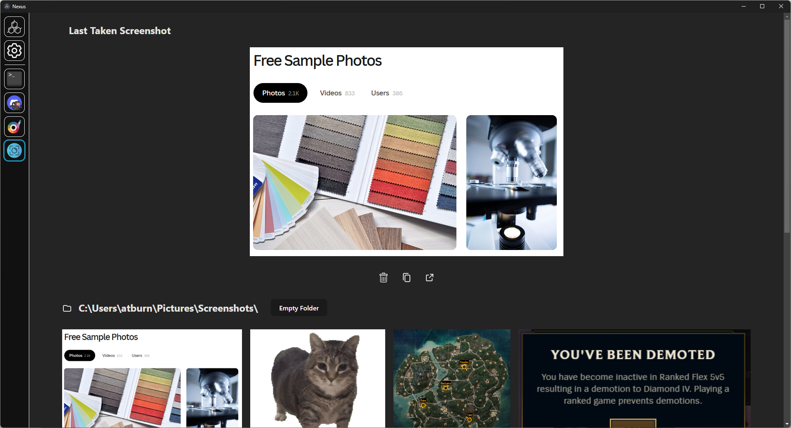

# [Nexus](https://github.com/aarontburn/nexus-core): Screenshot Manager

A screenshot manager module for Nexus.

	

## Installation
1. Download the latest release `.zip`. 
2. In Nexus, navigate to **Settings** > **Import Module**
3. Select the downloaded `.zip` file to install.

## Features
- **Screenshot Detection**: Automatically when a screenshot is taken and displays it to the user. 
  - This works by detecting any file changes within your `C:\Users\<user>\Pictures\Screenshots\` directory, which should be the default folder that screenshots are saved to. If your screenshots aren't saved automatically, this may not work. If your screenshots are saved in a different directory, you can modify this by changing the path in the settings.
- **Image Management**: Delete, copy, and view screenshots within your screenshot folder effectively.